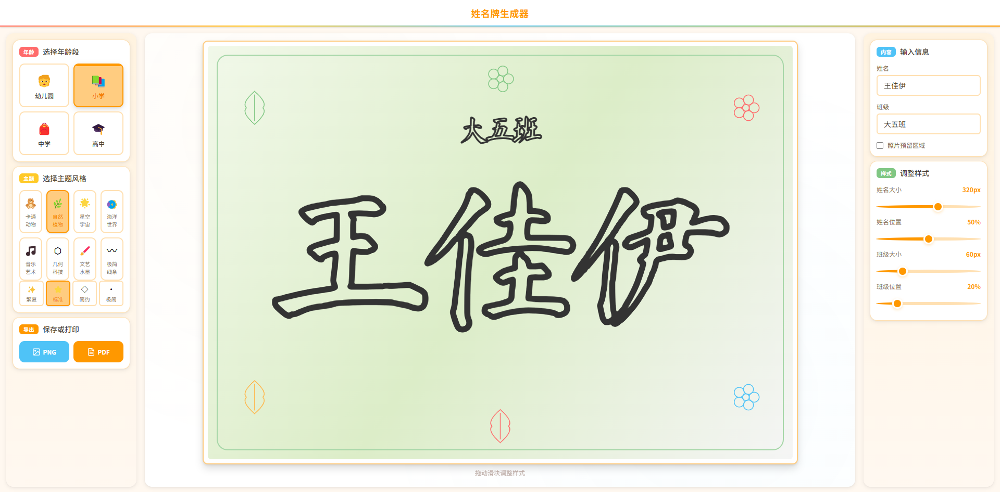

# 姓名牌生成器

一个纯前端的幼儿手绘姓名牌生成工具，帮助幼儿园老师为孩子们快速制作精美的手绘风格姓名牌。

## 预览



## 功能特点

- **多主题风格** - 8种精心设计的主题风格
  - 🐻 **可爱动物** - 卡通动物、星星、爱心装饰
  - 🌿 **自然风格** - 树叶、花朵等自然元素
  - 🚀 **太空主题** - 星星、月亮、火箭装饰
  - 🌊 **海洋风格** - 海浪、贝壳、小鱼元素
  - 🎵 **音乐主题** - 音符、画笔装饰
  - ◇ **几何风格** - 三角形、圆形、菱形元素
  - 🎨 **水墨风格** - 传统水墨效果
  - □ **简约风格** - 简洁线条设计

- **年龄段适配** - 根据不同年龄段自动调整样式

- **实时预览** - 所有修改即时反映在预览区域

- **自定义样式**
  - 姓名字体大小
  - 姓名位置调整
  - 班级信息显示
  - 班级大小和位置
  - 照片预留区域

- **装饰密度** - 可选择稀疏、适中、密集三种装饰密度

- **导出功能**
  - PNG 图片导出
  - PDF 文件导出（A4 尺寸，适合打印）

## 快速开始

### 本地使用

1. 克隆或下载本项目
   ```bash
   git clone https://github.com/your-username/nametag-designer.git
   ```

2. 直接打开 `index.html` 文件即可使用

无需安装依赖、无需构建步骤，纯静态网页应用。

## 技术栈

| 技术 | 说明 |
|------|------|
| HTML + CSS + JavaScript | 纯前端实现，无需构建 |
| Canvas API | 姓名、装饰绘制 |
| jsPDF | PDF 文件导出 |
| Google Fonts | 开源中文字体 |

## 项目结构

```
nametag-designer/
├── index.html           # 主页面
├── css/
│   ├── variables.css    # CSS 变量定义
│   ├── base.css         # 基础样式
│   ├── layout.css       # 布局样式
│   ├── components.css   # 组件样式
│   └── animations.css   # 动画效果
├── js/
│   ├── app.js           # 主入口、初始化
│   ├── state.js         # 状态管理
│   ├── canvas.js        # Canvas 设置
│   ├── renderer.js      # 绘制流程
│   ├── export.js        # 导出功能
│   ├── styles/          # 基础绘制样式
│   │   ├── base.js      # 基础绘制方法
│   │   └── decorations.js # 装饰绘制方法
│   ├── themes/          # 主题模块
│   │   ├── index.js     # 主题注册表
│   │   ├── animals.js   # 可爱动物主题
│   │   ├── nature.js    # 自然风格主题
│   │   ├── space.js     # 太空主题
│   │   ├── ocean.js     # 海洋主题
│   │   ├── music.js     # 音乐主题
│   │   ├── geometric.js # 几何风格
│   │   ├── ink.js       # 水墨风格
│   │   └── minimal.js   # 简约风格
│   └── ui/              # UI 组件
│       ├── age-selector.js      # 年龄段选择
│       ├── theme-selector.js    # 主题选择
│       ├── density-selector.js  # 装饰密度选择
│       ├── content-input.js     # 内容输入
│       ├── sliders.js           # 滑块控件
│       └── animations.js        # UI 动画
└── tests/               # 测试文件
```

## 使用场景

- 学校活动标识（幼儿园、小学等）
- 六一儿童节、开学典礼等节日活动
- 亲子活动、夏令营标识
- 课堂座位、作品展示标识
- 儿童生日派对装饰
- 托班、早教机构标识制作

## 浏览器支持

- Chrome（推荐）
- Edge
- Firefox
- Safari

建议使用最新版本浏览器以获得最佳体验。

## 许可证

MIT License

## 致谢

- 字体来源：Google Fonts
- PDF 导出：jsPDF 库